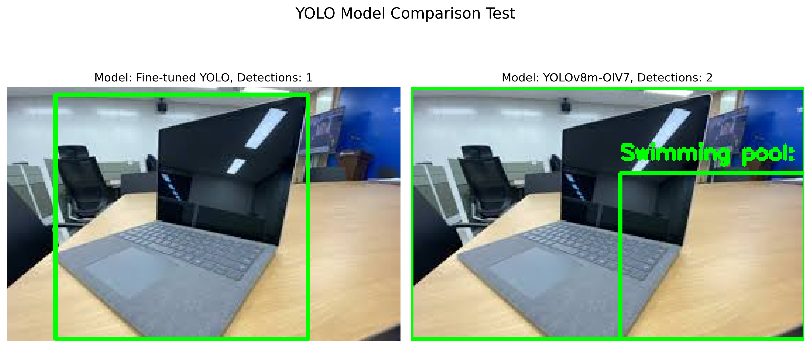
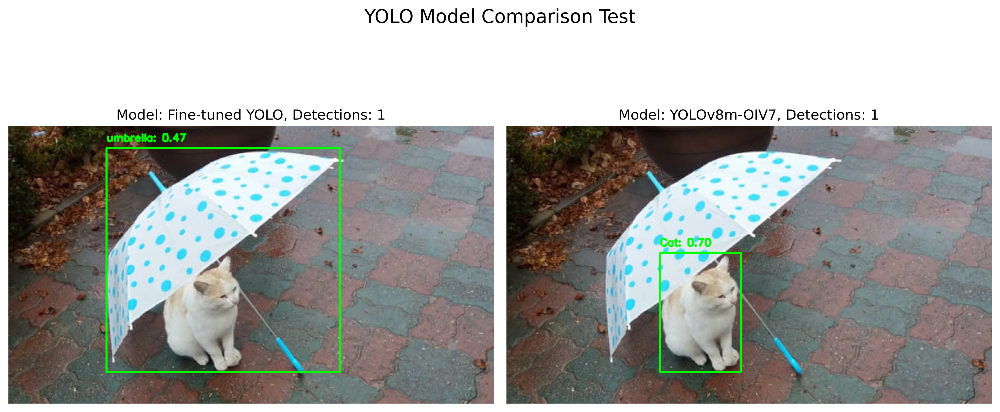
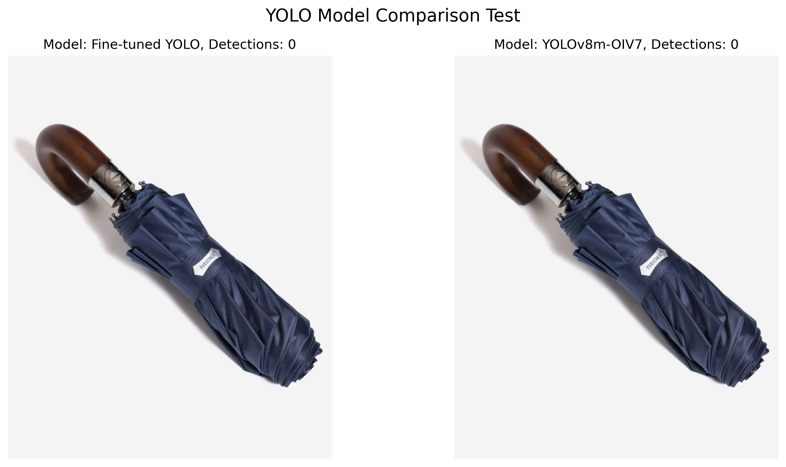
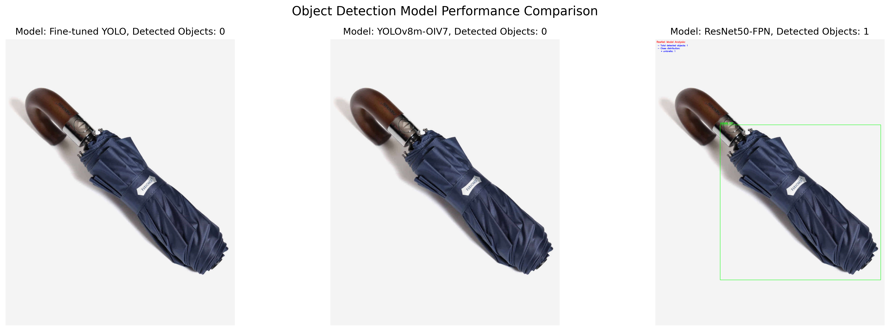

# [03.26] YOLO 파인튜닝 및 BLIP 한국어 이미지 캡셔닝 및 카테고리 분류

## 모델
- best.pt : YOLOv8m-oiv7.pt (medium) + COCO dataset (24: 백팩, 25: 우산, 26: 핸드백, 28: 가방/슈트케이스, 63: 노트북, 67: 휴대폰, 73: 책, 74: 시계)

## YOLO 파인튜닝 모델 테스트
### yolo_coco_test
- YOLOv8m-oiv7에 coco dataset으로 파인튜닝한 모델 테스트 코드
- laptop에 대한 감지는 기존 모델보다 나은 결과를 보임

- 핸드폰에 대한 결과는 기존 모델이 좋음

- 우산 감지도 기존 모델보다 나은 결과를 보임, BUT. 접힌 우산은 여전히 감지 못함



### yolo+resnet.py
- YOLOv8m-oiv7, YOLOv8m-oiv7에 coco dataset으로 파인튜닝한 모델, ResNet 모델 테스트
- ResNet 모델이 시간은 오래 걸리지만 이미지 분류를 잘하고 지갑을 들고 있는 가려진 손까지 인식 (사진의 다양한 물건들을 모두 탐지)
- ResNet 모델은 접힌 우산에 대해 탐지와 분류를 함

- ResNet모델이 이미지 분류를 위한 모델이라 YOLO 모델보다 정확도는 높지만 시간이 YOLO보다 2~3배 더 걸림
- YOLO 모델은 객체탐지 모델로 속도가 빠르고 실시간 객체 탐지에 적합 (모바일에도 적합)
    ∴ 속도 강점 살려 YOLO 모델로 객체탐지 결정

### resnet_test.py
- yolo+resnet.py와 같은 기능의 코드인데 결과 이미지에 resnet 객체 탐지 결과를 나타내주는 코드

### blip_translate.py
- BLIP + facebook/nllb-200-3.3B : 다중 언어 번역 모델 사용

## 분실물 등록 AI 방향
1. 이미지 전처리
    - 크기조정 
2. BLIP 이미지 캡셔닝
3. 정보 추출 (파싱 단계)
    - BLIP의 자연어 설명에서 색상, 재질, 유형 등 핵심정보 파싱
    - 기본 NLP 기술로 캡션에서 구조화된 데이터 추출
4. BLIP 결과에 보충하고 싶다면 GPT-4o Vision 이용한 고급 분석

### BLIP_info_v1.py
- BLIP 기반 분실물 분석기 (LostItemAnalyzer) 기능
    1. 모델 로딩: 캡셔닝과 시각적 질의응답(VQA)을 위한 두 가지 BLIP 모델 활용
    2. 이미지 전처리: 크기 조정 및 포맷 변환을 통한 최적화
    3. 캡션 생성: 이미지에 대한 기본 설명 생성
    4. 특징 추출: 카테고리, 색상, 재질, 브랜드 등을 파악하기 위한 질의응답 수행
    5. 게시글 정보 생성: 추출된 정보를 기반으로 제목과 설명 생성

#### 문제점
- 캡셔닝은 영어로 잘 나오지만 제목,카테고리, 색상, 재질에 대한 분석 결과가 좋지 않음
- VQA에 질문을 한국어로 줘서 문제가 생겼을 것으로 예상

#### 이슈 및 해결방향
- [v] VQA 모델의 질문을 영어로 바꿔서 v2로 테스트

### BLIP_info_v2.py
- 분실물 분석 결과가 v1에 비해 매우 나아짐
- 색상과 재질을 분류하고 제목에 어떤 색상의 물건명 식으로 꽤나 잘 나옴
- 카테고리 분류는 아직 마음대로 하는 것으로 보임

#### 이슈 및 해결
1. 브랜드 인식 개선
- 이슈 1. 기존에는 브랜드가 없는 (혹은 사진에 나타나지 않은) 이미지에서도 억지로 브랜드를 추출해내어 없는 브랜드를 결과로 추출
- 해결1. 이미지 캡션 상에서 브랜드가 추출되어 나온 경우에만 브랜드를 입력하도록 코드 수정
- 2단계 브랜드 확인 프로세스 : 1. 캡션에서 브랜드 찾음, 2. 브랜드 발견된 경우에만 해당 브랜드인지 확인하는 질문

```python
# 캡션에서 브랜드 추출 시도
caption_brand = self.extract_brand_from_caption(caption)

# 브랜드 질문은 캡션에서 브랜드가 발견된 경우에만 추가
if caption_brand:
    questions["brand"] = f"Is this a {caption_brand} product? Answer yes or no."
else:
    # 캡션에 브랜드가 없으면 브랜드를 묻지 않음
    questions["brand"] = "Is there any visible brand name on this item? If not, just say 'no'."
```
- 해결2. 일반 브랜드 목록 추가
```python
# 유명 브랜드 목록 (분실물로 흔한 브랜드)
        self.common_brands = [
            "apple", "samsung", "lg", "sony", "nike", "adidas", "puma", "reebok", "louis vuitton", 
            "gucci", "chanel", "prada", "hermes", "coach", "michael kors", "dell", "hp", "lenovo", 
            "asus", "acer", "timex", "casio", "seiko", "citizen", "logitech", "microsoft", "canon", 
            "nikon", "jbl", "bose", "sennheiser", "sony", "samsonite", "tumi", "kindle", "google"
        ]
```
- BUT. 테스트 결과 아이패드를 인식함에도 브랜드 결과가 없다고 나옴 (수정 필요)
- new problem. 갤럭시 탭은 못 알아봄 → laptop으로 인식

2. 카테고리 인식 개선
- 이슈 1. 기존에는 카테고리를 제대로 출력하지 않음
- 해결 1. 카테고리 매핑 추가 : 이미지 캡션 키워드를 적절한 카테고리에 매핑
```python
 # 카테고리 매핑 (캡션의 일반적인 단어를 카테고리로 매핑)
        self.category_mapping = {
            "umbrella": "umbrella",
            "phone": "phone", 
            "smartphone": "phone",
            "cellphone": "phone",
            "iphone": "phone",
            "wallet": "wallet",
            "bag": "bag",
            "handbag": "bag",
            "backpack": "bag",
            "computer": "computer",
            "laptop": "computer",
            "tablet": "electronics",
            "ipad": "electronics",
            "watch": "jewelry",
            "book": "books",
            "notebook": "books",
            "headphones": "electronics",
            "earphones": "electronics",
            "airpods": "electronics",
            "card": "card",
            "id": "id",
            "key": "others",
            "keys": "others",
            "glasses": "others",
            "sunglasses": "others",
            "camera": "electronics",
            "jewelry": "jewelry"
        }
```
- 해결 2. 캡션 우선 규칙: 카테고리 결정에서 캡션 분석 결과가 VQA 응답보다 우선시됨
```python
# 카테고리 우선순위 결정 (캡션 > VQA 응답)
if caption_category:
    final_category = caption_category
else:
    final_category = answers["category"]
```

3. 경고 제거 및 품질 개선
- 샘플링 관련 경고 제거: do_sample=True 설정 추가
- 재질 인식 개선: 캡션에서 재질 검색 추가
- 색상 인식 개선: 더 많은 색상과 검증 로직 추가

4. 제목 생성 로직 개선
- 제품명, 색상, 카테고리, 브랜드를 조합하여 더 정확한 제목 생성
- 브랜드는 캡션에서 확인된 경우에만 제목에 포함
```python
# 제목 생성 예시
if product_name:
    title = f"{color} {product_name}"
elif category:
    title = f"{color} {category}"
else:
    title = f"{color} item"
    
# 브랜드 추가 (있는 경우에만)
if brand and brand.lower() not in title.lower():
    title = f"{brand} {title}"
```

5. 로깅 개선
- 분석 과정의 주요 결정 로깅 추가
- VQA 질문과 응답 로깅 유지
- 캡션에서 추출된 정보 로깅

### BLIP_info_v3.py
#### 이슈 및 해결방향
- 이슈1. 캡션의 Distinctive features에 iphone is apple ' s best guess 라고 나오는데 브랜드를 apple로 인식하지 못함
- 해결1. brand_association 딕셔너리 추가로 제품명과 브랜드 매핑
```python
# 브랜드 연관 매핑 (제품 -> 브랜드 연결)
    self.brand_association = {
        # Apple 제품
        "ipad": "apple",
        "iphone": "apple",
        "macbook": "apple",
        "mac": "apple",
        "airpods": "apple",
        "ipod": "apple",
        
        # Samsung 제품
        "galaxy": "samsung",
        
        # 기타 제품들
        "gram": "lg",
        "airmax": "nike",
    }
```
- 여러 텍스트 소스에서 브랜드를 찾고 브랜드 연관성도 고려

#### 문제점
- 색상을 프론트에서 제공하는 색상으로 맞출 필요있음

### blip_fastapi_ko.py
- BLIP_info_v3.py 코드를 토대로 분석 결과가 영어로 나오는 부분을 한국어로 번역해서 결과 제공
```
{
  "status": "success",
  "data": {
    "title": "파란색 우산",
    "category": "우산",
    "color": "파란색",
    "material": "플라스틱",
    "brand": "알 수 없음",
    "description": "A blue umbrella with a curved handle.\n\n재질: 플라스틱\n특이사항: It has a curved handle and is folded",
    "distinctive_features": "It has a curved handle and is folded"
  }
}
```
#### 문제점
- 삼성 핸드폰을 갤럭시 노트로 잘 구분하는데 카테고리 구분을 phone으로 못하고 mp3 플레이어나 다른 카테고리로 분류해버림

### 파일
- YOLO 학습된 파일 : best.pt, 기존 YOLO 파일 : yolov8m-oiv7.pt