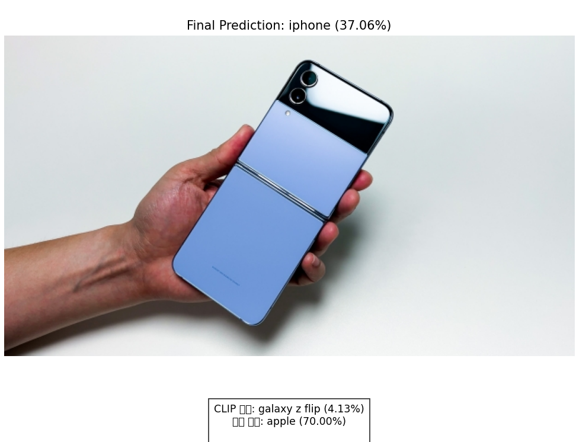

# [03.31] 분실물 매칭 AI 구현 : CLIP 모델 코드 개선 및 테스트

### clip_cos+mean_v2.py
- 게시글의 이미지 유무에 따른 대응 개선
1. 동적 가중치 시스템 도입:
    - 이미지와 텍스트 사이의 가중치를 동적으로 조정합니다.
    - 이미지가 없는 경우 자동으로 텍스트에 100% 가중치를 부여합니다.
    - 이미지-텍스트 일관성이 높을수록 이미지에 더 많은 가중치를 부여합니다.

2. 카테고리 기반 매칭 강화:
    - 단순 그룹화가 아닌 매칭 우선순위를 적용합니다:
        1. 카테고리 일치 항목
        2. 키워드 매칭 항목 (카테고리는 다르지만 관련 키워드 포함)
        3. 기타 유사 항목

3. 이미지 없음 처리 개선:
    - 이미지가 없는 경우 페널티 대신 텍스트 유사도만으로 평가합니다.
    - 결과 표시 시 이미지 사용 여부를 명시적으로 보여줍니다.

4. 유사도 상세 분석 기능 향상:
    - 카테고리 일치 시 유사도 보너스 적용 (최대 20%)
    - 키워드 매칭 시 유사도 보너스 적용 (최대 10%)
    - 각 항목의 유사도 계산 근거를 상세히 설명하는 기능 추가

5. 사용자 인터페이스 개선:
    - 한글 폰트 지원 (그래프 시각화)
    - 대화형 테스트 모드 추가 (이미지 사용 여부, 검색 데이터 수 등을 입력받음)

6. 결과 출력 개선:
    - 각 항목에 대한 상세 정보 표시 (이미지 사용 여부, 가중치 정보 등)
    - 카테고리별 구분으로 결과를 더 직관적으로 이해할 수 있게 함

### clip_classification.py
- CLIP 코드가 초기에 모델만 사용할 때는 지갑, 우산 등 물체를 잘 알아보지 못했었음. 해당 문제를 개선한 코드
#### CLIP 코드 발전 과정 및 인식 능력 향상 설명
- 초기 코드의 한계
    - 처음 작성한 CLIP 코드에서는 우산이나 지갑 같은 물체를 인식하지 못했던 주요 이유가 있다:
    1. CIFAR-100 클래스 제한: 초기 코드는 CIFAR-100 데이터셋의 100개 클래스만 인식할 수 있었다. CIFAR-100에는 '우산', '지갑' 등의 클래스가 없기 때문에, 이미지에 이러한 물체가 있어도 인식할 수 없다. (이 내용은 명세서의 CLIP 사용법 기반이므로 큰 관련 X, 참고만)
    2. 프롬프트 제한: 코드는 "a photo of a {label}" 형식의 단일 프롬프트만 사용

    ```python
    # 초기 코드
    def tokenize_labels(classes):
        text_inputs = torch.cat([clip.tokenize(f"a photo of a {c}") for c in classes]).to(device)
        with torch.no_grad():
            text_features = model.encode_text(text_inputs)
            text_features /= text_features.norm(dim=-1, keepdim=True)
        return text_features
    ```
- 주요 개선 사항
1. 클래스 확장
첫 번째 중요한 변화는 인식 가능한 클래스 목록을 확장한 것:
```python
# 개선된 코드
additional_classes = [
    "umbrella", "wallet", "smartphone", "tablet", ... # 다양한 클래스 추가
]
all_classes = classes + additional_classes
```
이렇게 함으로써 CLIP 모델이 원래 가지고 있던 넓은 세계 지식을 활용할 수 있게 되었다. CLIP은 4억 개의 이미지-텍스트 쌍으로 사전 학습되었기 때문에, 우리가 클래스 이름만 알려주면 해당 객체를 인식할 수 있는 능력이 있었다.

2. 다양한 프롬프트 변형 적용
두 번째 핵심 변화는 각 클래스에 대해 다양한 프롬프트 형식을 제공한 것:
```python
# 개선된 코드
prompts = [
    f"a photo of {article} {c}",
    f"a picture of {article} {c}",
    f"{article} {c}",
    f"the {c}"
]
```
CLIP은 텍스트와 이미지의 관계를 학습하는 모델이기 때문에, 다양한 방식으로 표현된 텍스트와 이미지를 매칭할 수 있다. 같은 객체에 대해 여러 표현 방식을 제공함으로써 인식 성공률을 높였다.
3. 컨텍스트 특화 프롬프트 추가
세 번째 변화는 각 카테고리에 특화된 컨텍스트를 제공한 것:
```python
# 개선된 코드
if c in ["wallet", "purse", "credit card", ...]:
    prompts.append(f"a lost {c}")
    prompts.append(f"a personal {c}")
```
이렇게 특화된 컨텍스트를 제공함으로써, 모델이 해당 객체의 특성을 더 잘 이해하고 인식할 수 있게 되었다.
4. 문법적 개선과 관사 처리
추가적인 개선 사항으로 영어 문법에 맞는 관사 사용과 복수형 단어 처리를 개선했다:
```python
# 개선된 코드
article = "an" if c[0].lower() in "aeiou" else "a"  # 'a' 또는 'an' 선택

if c == "glasses" or c == "keys":  # 복수형 단어 처리
    prompts = [
        f"a photo of {c}",
        f"a pair of {c}",
        ...
    ]
```
5. 제조사 특화 프롬프트 (최종 버전)
마지막으로 제조사별로 특화된 프롬프트를 추가하여 갤럭시 워치와 애플 워치 같은 유사 제품들을 더 정확히 구분할 수 있게 했습니다:
```python
# 최종 코드
if c == "galaxy watch":
    prompts.append(f"a samsung smartwatch")
    prompts.append(f"a round smartwatch")
```
결론: CLIP의 잠재력 활용
CLIP 모델은 처음부터 우산, 지갑, 에어팟 등을 인식할 능력이 있었지만, 초기 코드에서는 이러한 잠재력을 활용하지 못했다. 우리가 한 일은 다음과 같다:
- 인식 가능한 클래스 확장: CIFAR-100의 제한된 100개 클래스를 넘어 다양한 일상 물체를 인식할 수 있게 했다.
- 다양한 표현 방식 제공: 같은 객체에 대해 여러 가지 텍스트 표현을 제공함으로써 인식 성공률을 높였다.
- 특화된 컨텍스트 추가: 각 카테고리와 제품군에 맞는 특화된 표현을 추가

결과적으로 CLIP 모델이 가진 원래의 강력한 능력을 효과적으로 끌어낼 수 있게 되었고, 이로 인해 우산, 지갑, 갤럭시 워치 등 다양한 물체를 인식할 수 있게 되었다.

### clip_classification_v2.py
- 기존 코드에서 CIFAR-100 클래스에서 사용할 정보가 적으므로 해당 코드 제거 후 한국의 돈이나 차 키 등 한국 맞춤형 및 경찰청 카테고리에 맞게 수정

### 문제점
- [x] 갤럭시 폴드, 플립을 못알아봄 → 아이폰, 태블릿으로 결과가 나옴

### clip_classification_v3.py
- v2 코드에서 갤럭시 폴드와 플립을 못알아보는 현상 개선

### 해결
삼성 폴더블 폰(갤럭시 Z 플립, 갤럭시 Z 폴드)을 알아보는 메커니즘은 여러 단계의 분석과 기술이 결합되어 작동합니다. 기존의 CLIP 모델은 폴더블 폰을 일반 스마트폰이나 아이폰으로 잘못 인식하는 경우가 많았다. 이를 개선하기 위해 다음과 같은 방법이 적용되었다:

1. 특화된 클래스와 프롬프트 추가
코드에 폴더블 폰에 대한 특화된 클래스와 프롬프트를 추가했습니다:

```python
# 전자기기 (삼성 폴더블)
"galaxy z flip", "galaxy z fold", "samsung foldable phone", "foldable phone",
"samsung folding phone", "폴더블 스마트폰", "접이식 휴대폰", "갤럭시 Z 플립", "갤럭시 Z 폴드"
```
그리고 이러한 클래스에 대해 다양한 설명 프롬프트를 추가했습니다:
```python
prompts.append(f"a samsung foldable phone")
prompts.append(f"a foldable smartphone")

if is_flip:
    prompts.append(f"a samsung galaxy z flip")
    prompts.append(f"a flip phone that folds horizontally")
    prompts.append(f"a clamshell folding phone")

if is_fold:
    prompts.append(f"a samsung galaxy z fold")
    prompts.append(f"a phone that folds like a book")
    prompts.append(f"a fold phone that opens into a tablet")

prompts.append(f"a samsung device that folds")
prompts.append(f"a premium samsung folding phone")
```
2. 로고 감지 기능
삼성 로고를 인식하는 로직을 추가했습니다. 이 기능은 다음과 같이 작동합니다:
- CLIP 모델을 사용하여 "samsung logo", "samsung symbol" 등의 프롬프트와 이미지의 유사도 계산
- OpenCV를 사용한 에지 감지 및 컨투어 분석으로 삼성 로고의 직사각형 형태 감지
3. 가로세로 비율 분석으로 플립과 폴드 구분
폴더블 폰으로 인식된 경우, 이미지의 가로세로 비율을 분석하여 플립인지 폴드인지 구분합니다:
```python
# 삼성 갤럭시 폴더블 중 접혀 있으면 보통 Z Flip, 펼쳐져 있으면 보통 Z Fold
image = Image.open(image_path).convert("RGB")
width, height = image.size
if width > height:
    final_class = "galaxy z fold"  # 가로가 길면 폴드로 추정
else:
    final_class = "galaxy z flip"  # 세로가 길면 플립으로 추정
```
갤럭시 Z 폴드는 펼쳤을 때 태블릿 같은 넓은 디스플레이를 가지므로 가로가 길고, 갤럭시 Z 플립은 접었을 때 세로로 긴 형태를 가집니다.

4. 색상 분석
이미지의 RGB 히스토그램을 분석하여 삼성 제품에 많이 사용되는 색상(흰색, 검은색, 파란색)의 분포를 확인합니다. 이 정보는 최종 결정에 가중치를 추가합니다.

5. 결과 통합
기본 CLIP 결과, 로고 감지, 색상 분석, 형태 분석 등 모든 정보를 종합하여 최종 판단을 내립니다. 로고가 감지되고 삼성 제품으로 판단되면, 이미지 비율에 따라 플립 또는 폴드로 결정합니다.

이러한 다중 단계 분석을 통해 기존 모델이 어려워하던 폴더블 폰 인식 능력이 크게 향상되었습니다.

### 문제점
- 아이폰도 삼성 폴더블폰으로 인식해버리는 문제 발생
    - Why? 이미지 전체에 파란색이 많이 포함되어 있어서 색상 분석에서 삼성 제품으로 판단 → 색상 관련 브랜드 분석 완전 제거




