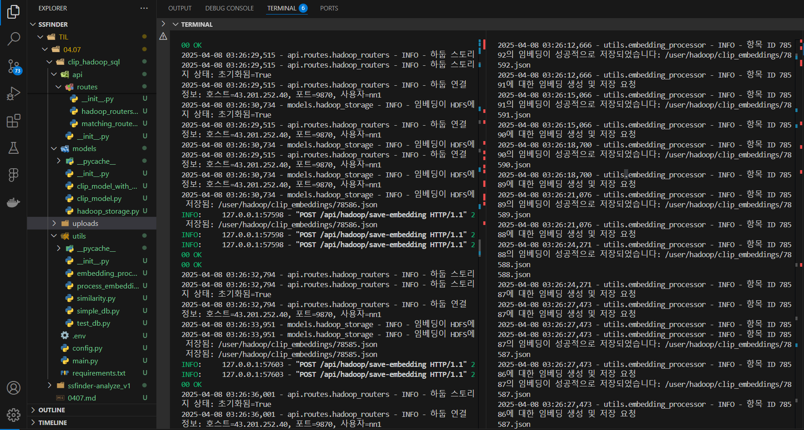

# [04.07] 이미지 분석 AI 배포 및 매칭 AI 임베딩 하둡 저장

## ai-analyze huggingface 배포
### ec2 서버 문제점
- 해킹 이슈로 ec2 서버에 채굴 프로그램이 설치되어 Fast api와 충돌 → Fast API의 uvicorn도 cpu를 많이 쓰는데 채굴 프로그램도 많이 써서 서로 충돌 후 Fast api 배포 서버가 고장난 것으로 추측
- ec2 배포 서버를 이용해 spring boot 코드로 이미지 분석 요청을 보내보았으나 몇십분이 지나도 응답이 나오지 않음
    - 로그에 딱히 에러가 찍히지도 않고 cpu만 엄청 잡아먹고 작업이 오래걸리는 건지 결과가 나오지 않음
### 결론
- AI 서버를 따로 배포하기로 함
- render, railway, replicate 등 여러가지 알아봤지만 hugging face로 결정
- 모델이 huggingface 상에 있기도 하고 현재 fast api 코드로 배포하기도 가장 쉬웠기 때문
- BUT. 로컬에서 이미지 분석 5초 걸리던게 서버 올라가니까 40초 초반대 나옴
    - 왜 항상 서버에 올라가면 AI 분석 시간이 몇배는 더걸리는지 알고 싶다..
- 결론 : hugging face 유료 GPU를 시연 때 쓰기로 하고 배포를 huggingface로 유지
    - GPU를 쓸 수 있으면 GPU 사용하고 아니면 CPU 쓰는 코드로 최종 수정 완료
- 최종 이미지 분석 AI 완성 : ssfinder-analyze

### ssfinder-analyze_v1
- cpu로 코드가 실행되어 40초 초반대 걸림
- 이후 시간 단축을 위해 GPU 설정을 추가하여 v2 구현 (Hugging face GPU 사용 예정)

### clip_hadoop
- 서버를 켠 후 docs에서 /api/hadoop/save-embedding으로 목데이터를 넣으면 임베딩이 생성되어 서버 하둡에 저장되는 코드

### clip_hadoop_sql
- MySQL DB에서 게시글 데이터 몇십개를 가져와 임베딩을 생성해 서버 하둡에 저장되는 코드
```
python -m utils.process_embeddings --host=j12c105.p.ssafy.io --port=3306 --user=ssafy --password='tnatnavkdlsejssafyc!)%' --database=ssfinder --limit=20
```


### clip_hadoop_sql_all
- MySQL DB에서 모든 게시글을 차례로 가져와 임베딩 생성해 하둡에 저장되는 코드
- 중복 임베딩이 저장되지 않도록 코드 구현
- 중단되더라도 중단 포인트부터 다시 실행되는 코드
- 약 1시간에 1000개(이상) 정도의 게시글 임베딩을 생성하는 것으로 추정

### .env
```
HADOOP_HOST=43.201.252.40
HADOOP_PORT=9870
HADOOP_USER=nn1
```

