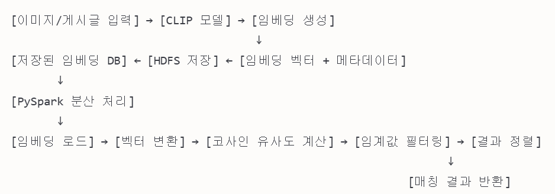

# [04.08] 게시글 매칭 AI Spark 분산처리

### matching-spark
- src/similarity_engine.py - 유사도 계산 엔진
- src/main.py - 메인 실행 파일
- src/utils.py - 유틸리티 함수
- src/config.py - 시스템 설정
- conf/spark-defaults.conf - Spark 설정
- similarity_test.ipynb 노트북 파일은 시스템을 테스트하고 분석하기 위한 목적

## 분실물 매칭 서비스 코드 설명 및 흐름도
### 전체 시스템 개요
이 시스템은 사용자가 분실한 물건의 이미지를 제공하면, 기존에 등록된 물건들과 유사도를 비교하여 가장 비슷한 물건들을 추천해주는 분산 처리 서비스입니다. CLIP 모델을 사용하여 이미지 임베딩을 생성하고, Apache Spark를 통해 분산 환경에서 대규모 임베딩 유사도 계산을 수행합니다.

### 시스템 아키텍처 및 데이터 흐름
1. 이미지 임베딩 생성 및 저장 단계:
    - 기존 게시글 이미지를 CLIP 모델로 임베딩 생성
    - 임베딩 벡터를 메타데이터와 함께 HDFS에 저장

2. 유사도 계산 단계:
    - 새로운 분실물 이미지의 임베딩 생성
    - PySpark를 통해 기존 임베딩과 코사인 유사도 계산
    - 임계값 이상의 매칭 결과 반환

### 주요 컴포넌트 설명
1. similarity_engine.py
분산 환경에서 임베딩 유사도 계산을 수행하는 핵심 엔진입니다.
- 주요 기능:
    - Hadoop에서 임베딩 데이터 로드
    - 임베딩 벡터를 ML 라이브러리용 벡터로 변환
    - 분산 환경에서 코사인 유사도 계산
    - 임계값 이상의 유사도를 가진 결과 필터링
    - 유사도 결과 정렬 및 반환

2. main.py
시스템의 진입점으로, 명령행 인터페이스를 제공합니다.
- 주요 기능:
    - 커맨드 라인 인자 처리
    - 쿼리 임베딩 로드
    - 유사도 엔진 초기화 및 실행
    - 결과 출력 및 저장

3. utils.py
다양한 유틸리티 함수를 제공합니다.
- 주요 기능:
    - 로깅 시스템 설정
    - CLIP 모델 관련 함수(로드, 임베딩 생성)
    - HDFS 접근 및 데이터 처리 유틸리티
    - 유사도 계산 함수(코사인, 유클리드 등)
    - 결과 포매팅 유틸리티

4. config.py
시스템 전반의 설정을 관리합니다.
- 주요 설정:
    - Hadoop/HDFS 설정
    - 임베딩 모델 설정
    - Spark 클러스터 설정
    - 유사도 계산 설정
    - 캐싱 및 로깅 설정

5. spark-defaults.conf
Spark 클러스터에 대한 세부 설정을 제공합니다.
- 주요 설정:
    - 메모리 및 코어 할당
    - 셔플 동작 설정
    - 직렬화 옵션
    - SQL 최적화 설정
    - 이벤트 로깅 설정

6. similarity_test.ipynb
시스템 테스트를 위한 노트북입니다.
- 주요 기능:
    - 전체 워크플로우 테스트
    - 다양한 임계값에 대한 성능 분석
    - 결과 시각화 및 분석
    - 시스템 최적화를 위한 지표 제공

### 상세 데이터 흐름도
[이미지/게시글 입력] → [CLIP 모델] → [임베딩 생성]
                                     ↓
[저장된 임베딩 DB] ← [HDFS 저장] ← [임베딩 벡터 + 메타데이터]
       ↓
[PySpark 분산 처리]
       ↓
[임베딩 로드] → [벡터 변환] → [코사인 유사도 계산] → [임계값 필터링] → [결과 정렬]
                                                                  ↓
                                                            [매칭 결과 반환]

### 시스템 실행 흐름
1. 데이터 준비 단계:
    - 기존 게시글/이미지 수집 및 전처리
    - CLIP 모델을 통한 임베딩 생성
    - 임베딩 및 메타데이터 HDFS 저장

2. 서비스 실행 단계:
    - 새로운 분실물 이미지 입력
    - 이미지 임베딩 생성
    - main.py 실행하여 유사도 계산 서비스 시작
    - 명령행 인자로 임계값, 상위 결과 수 등 지정

3. 유사도 계산 단계:
    - Spark 세션 초기화
    - HDFS에서 임베딩 데이터 로드
    -분산 환경에서 코사인 유사도 계산
    - 지정된 임계값 이상 결과만 필터링

4. 결과 처리 단계:
    - 유사도 순으로 결과 정렬
    - JSON 포맷으로 결과 저장 또는 반환
    - 사용한 Spark 자원 정리

### 성능 최적화 포인트
1. Spark 설정 최적화:
    - 메모리 및 코어 할당 조정
    - 셔플 파티션 수 최적화
    - 캐싱 전략 구현

2. 임베딩 저장 및 접근 최적화:
    - HDFS 파티셔닝 전략
    - 자주 사용되는 임베딩의 메모리 내 캐싱

3. 유사도 계산 최적화:
    - 근사 최근접 이웃(ANN) 알고리즘 적용 가능성
    - 다차원 인덱싱을 통한 검색 속도 향상